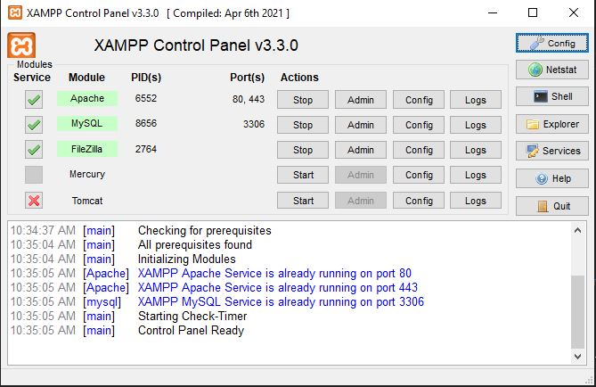
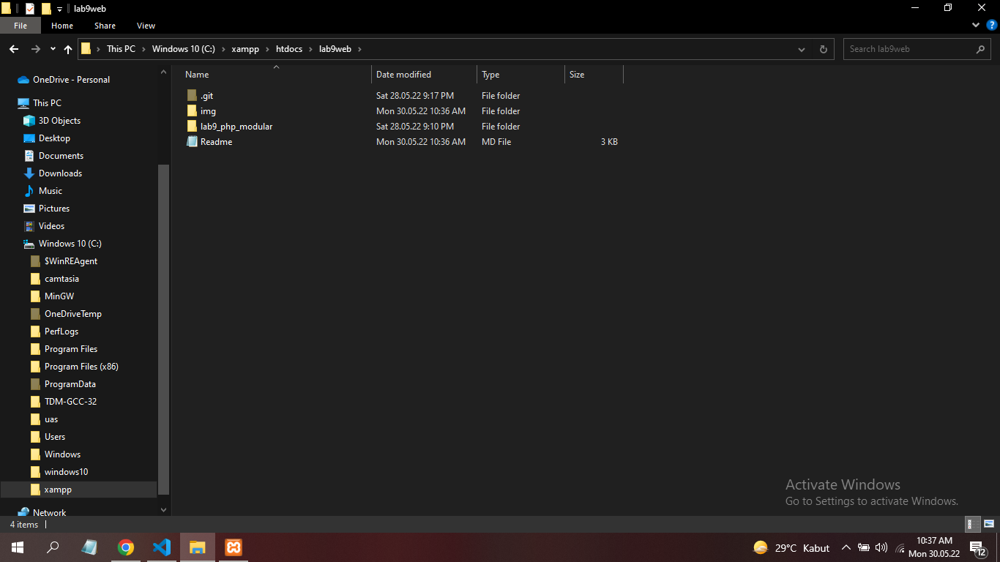
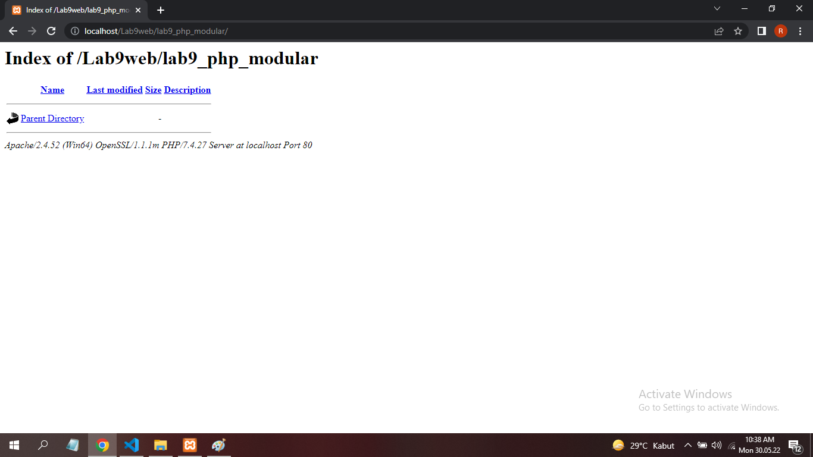
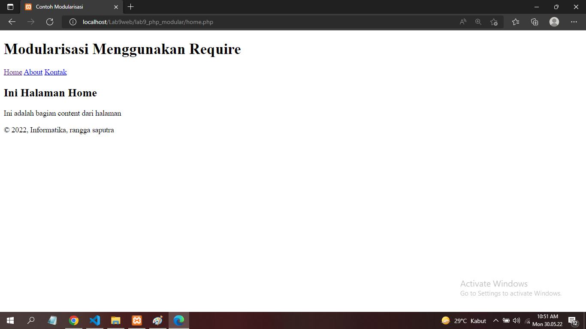
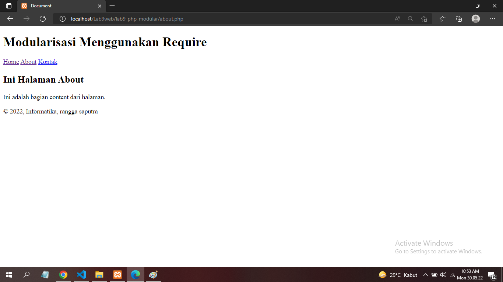
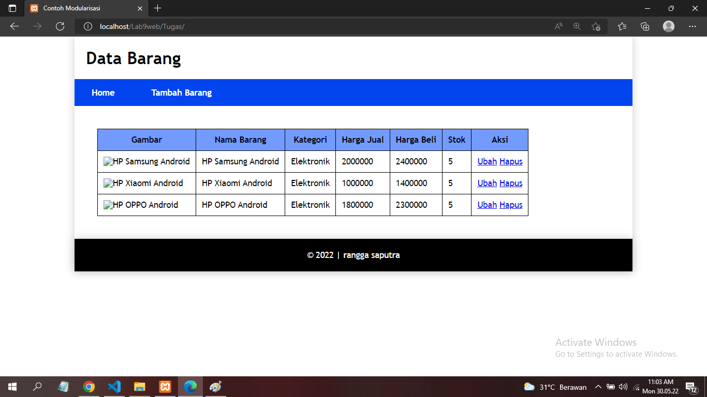
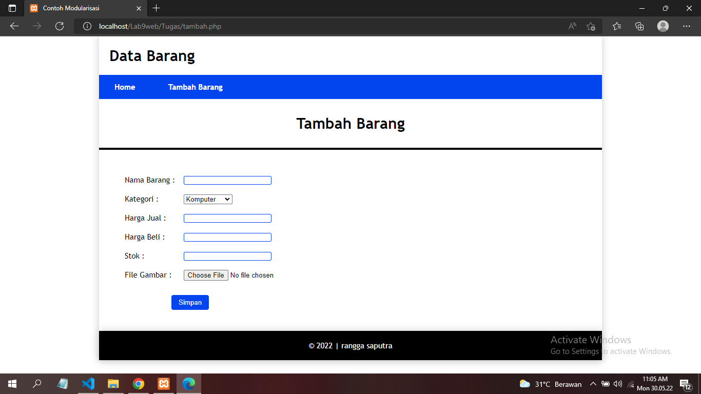
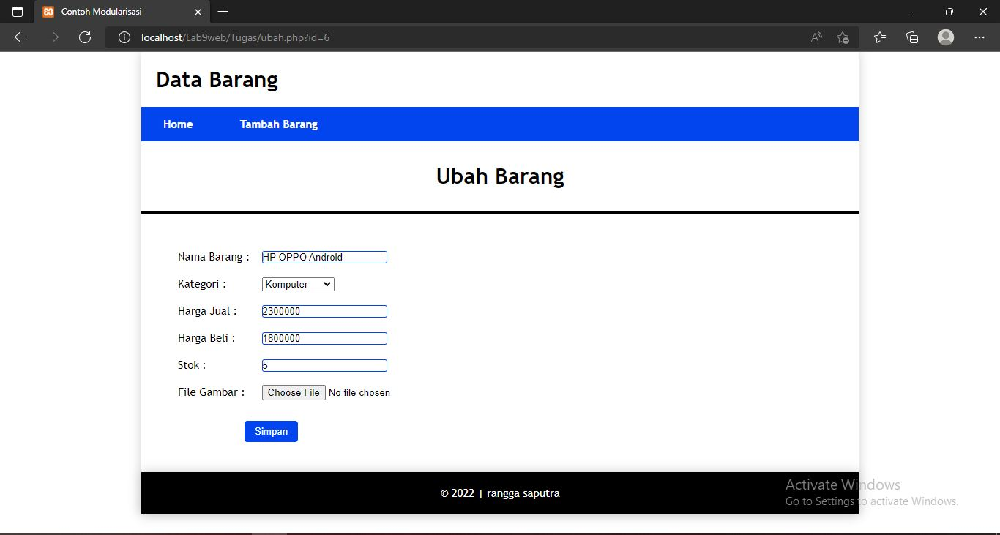

# Praktikum 9

## Profil
| | Biodata |
| -------- | --- |
| **Nama** | Rangga Saputra |
| **NIM** | 312010266 |
| **Kelas** | TI.20.A2 |
| **Mata Kuliah** | Pemrograman Web |

## 1. Menjalankan Server

Untuk menjalankan MySQL Server dari menu XAMPP Control seperti berikut.



## 2. Membuat Folder Baru

1. Membuat folder `Lab9web` di direktori htdocs
2. Lalu buat file dengan nama `lab9_php_modular` , kemudian tambahakan seperti berikut.



3. Kemudian untuk mengakses direktori tersebut pada web server dengan mengakses URL: http://localhost/Lab9web/lab9_php_modular/



## 3. Membuat File Header

1. Buat file dengan nama `header.php`
2. Tambahkan kode berikut.

```html
<!DOCTYPE html>
<html lang="en">
<head>
    <meta charset="UTF-8">
    <meta http-equiv="X-UA-Compatible" content="IE=edge">
    <meta name="viewport" content="width=device-width, initial-scale=1.0">
    <title>Contoh Modularisasi</title>
    <link rel="stylesheet" href="style.css">
</head>
<body>
    <div class="container">
        <header>
            <h1>Modularisasi Menggunakan Require</h1>
        </header>
    </div>
    <nav>
        <a href="home.php">Home</a>
        <a href="about.php">About</a>
        <a href="kontak.php">Kontak</a>
    </nav>
</body>
</html>
```

## 4. Membuat File Footer

1. Buat file dengan nama `footer.php`
2. Tambahkan kode berikut.

```html
    <footer>
        <p>&copy; 2022, Informatika, rangga saputra</p>
    </footer>
</body>
</html>
```

## 5. Membuat File Home

1. Buat file dengan nama `home.php`
2. Tambahkan kode berikut.

```php
<?php require('header.php'); ?>
<div class="content">
    <h2>Ini Halaman Home</h2>
    <p>Ini adalah bagian content dari halaman</p>
</div>
<?php require('footer.php')?>
```

## 6. Membuat File About

1. Buat file dengan nama `about.php`
2. Tambahkan kode berikut.

```php
<?php require('header.php'); ?>
<div class="content">
    <h2>Ini Halaman About</h2>
    <p>Ini adalah bagian content dari halaman.</p>
</div>
<?php require('footer.php'); ?>
```

# Berikut tampilannya.

Untuk halaman **Home** tampilannya seperti berikut.



Untuk halaman **About** tampilannya seperti berikut.



# Pertanyaan dan Tugas

Implementasikan konsep modularisasi pada kode program **praktikum 8** tentang database, sehingga setiap halamannya memiliki template tampilan yang sama.

# Hasil

Tampilan bagian **Home**



Tampilan bagian **Tambah Barang**



Tampilan bagian **Ubah Barang**

